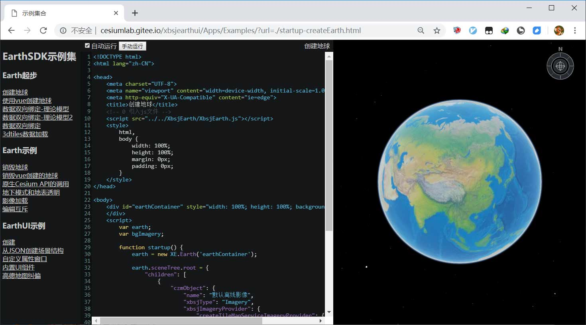
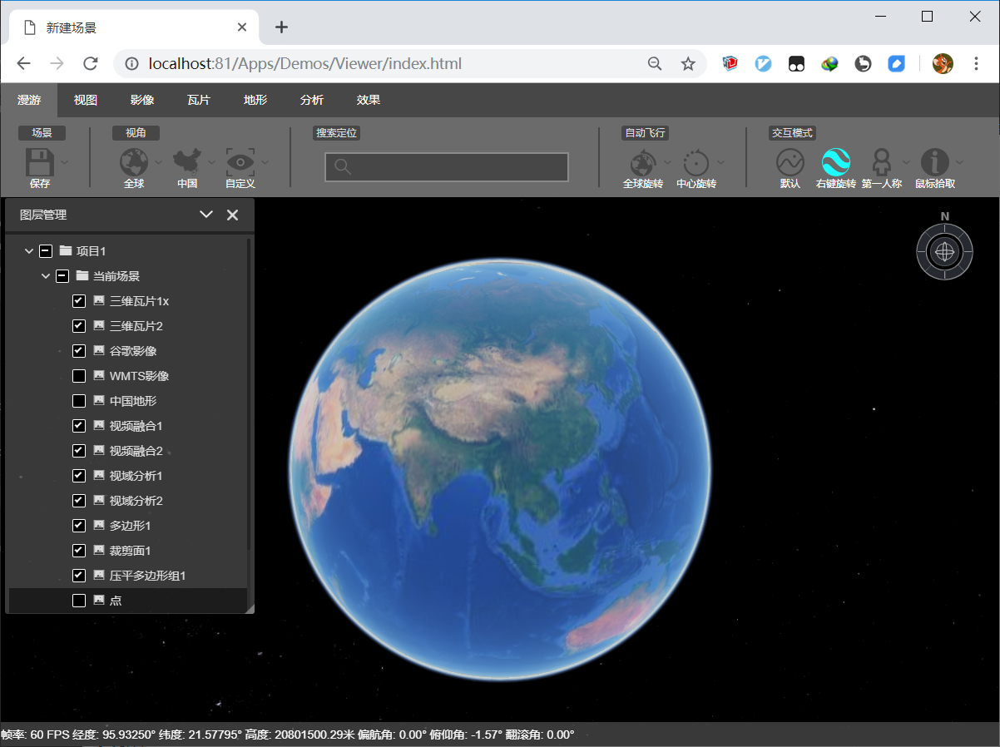
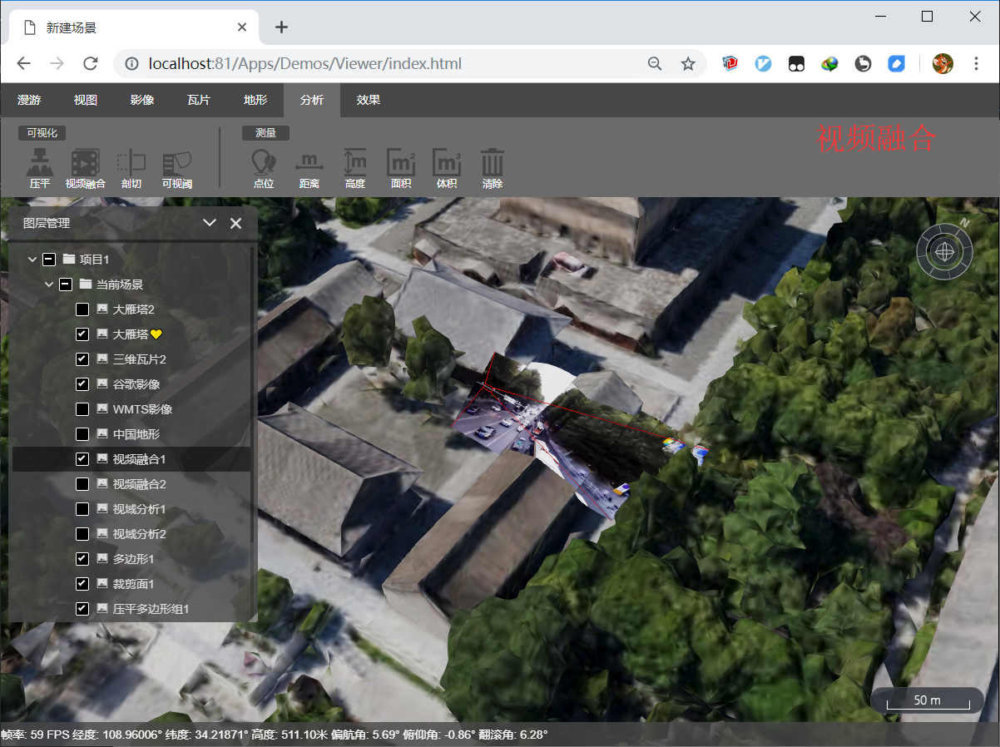
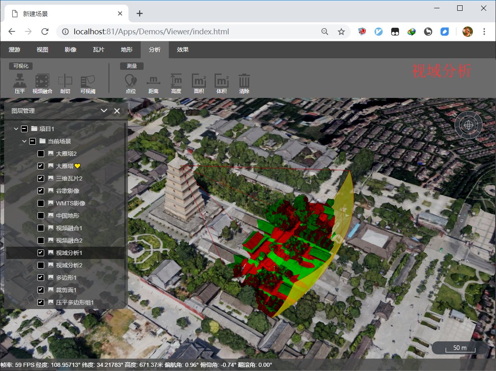
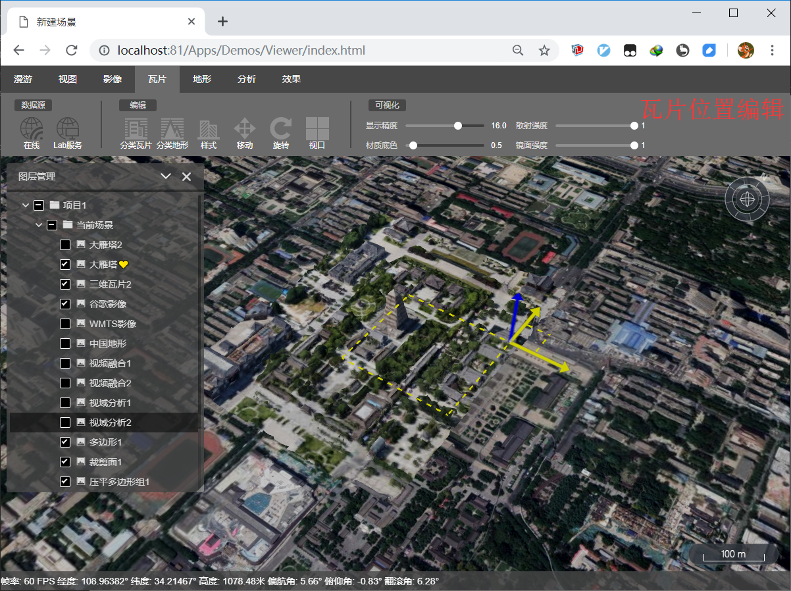
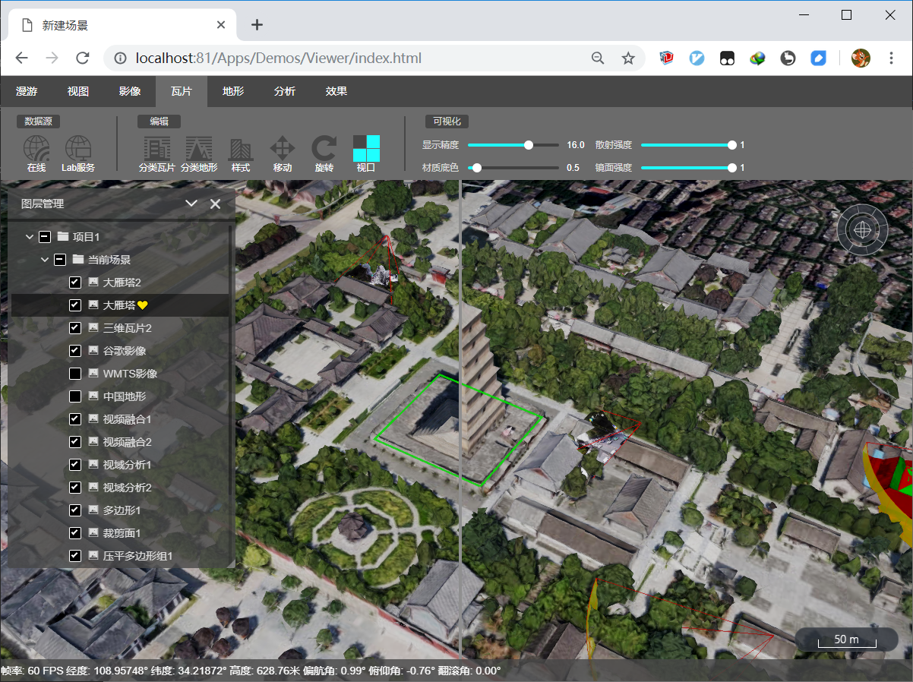

# XbsjEarthUI

# 🌏

_我愿与你同行，因你势不可挡！_

## 简介

XbsjEarthUI是基于Cesium和EarthSDK的三维GIS/BIM的UI模板，可以基于此定制自己的三维App。  
官网地址: earthsdk.com

* 使用指南  
    * github https://github.com/cesiumlab/XbsjEarthUI/wiki  
    * 知乎 https://zhuanlan.zhihu.com/p/80749244  

* 视景器 https://earthsdk.com/v/last/Apps/Demos/Viewer/index.html  
* 示例集 https://earthsdk.com/v/last/Apps/Examples/  

* API文档  
    * EearthSDK API文档 https://earthsdk.com/v/last/XbsjEarth/Documentation/  
    * Cesium API文档：http://earthsdk.com/c/1.60/Build/Documentation/index.html  
    * XbsjEarthUI API文档 https://earthsdk.com/v/last/XbsjEarthUI/Documentation/  

* EarthSDK & XbsjEarthUI 源码地址  
    * github: https://github.com/cesiumlab/XbsjEarthUI  
    * gitee(国内服务器，速度较快): https://gitee.com/cesiumlab/XbsjEarthUI  

* EarthSDK & XbsjEarthUI 近期发布的版本  
    * EarthSDK+XbsjEarthUI(最新版，可能不稳定)： https://earthsdk.com/v/last/ (下载)[https://earthsdk.com/v/last.zip]  
    * EarthSDK+XbsjEarthUI 1.1.0(2019/9/2): https://earthsdk.com/v/v1.1.0 (下载)[https://earthsdk.com/v/v1.1.0.zip]  
    * EarthSDK+XbsjEarthUI 1.0.1(2019/8/1): http://earthsdk.com/v/v1.0.1 (下载)[http://earthsdk.com/v/v1.0.1.zip]  

* 其他项  
    * XbsjEarthUI操作视频：https://www.bilibili.com/video/av60366649?from=search&seid=3851172190041118781  
    * EarthSDK的响应式属性设计：https://www.jianshu.com/p/a37cc18ca310  
    * CesiumLab2.0 和 EarthSDK 的首次培训视频：https://www.bilibili.com/video/av61977045/  

  
  
  
  

## 使用步骤

### 开发模式

1. npm install
2. npm run dev
3. 浏览器地址栏输入 localhost:9530

### 使用模式

1. npm install
2. npm run build
3. cd dist  // ***这一步很重要！！！务必在dist目录下启动hs，很多人反馈打不开页面，都是因为少了这一步！***
4. hs -p 81 启动服务
5. 浏览器地址栏输入 localhost:81/index.html

注意：hs 是 http-server 的缩写，如果没有此命令，可以提前安装：npm install -g http-server

## 问题反馈

欢迎进行问题反馈和相关技术交流！
有以下两种途径：

1 QQ 群：830157717  

2 提 issue：  
https://github.com/cesiumlab/XbsjEarthUI/issues
